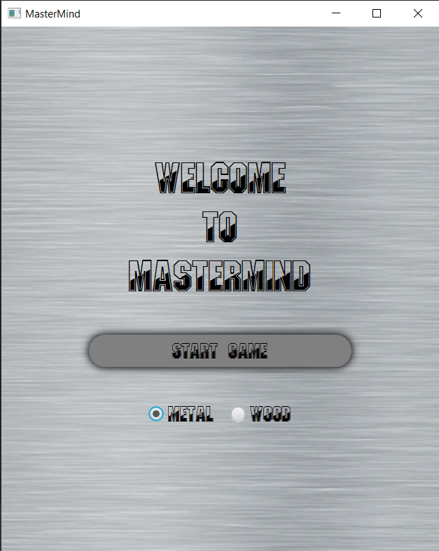
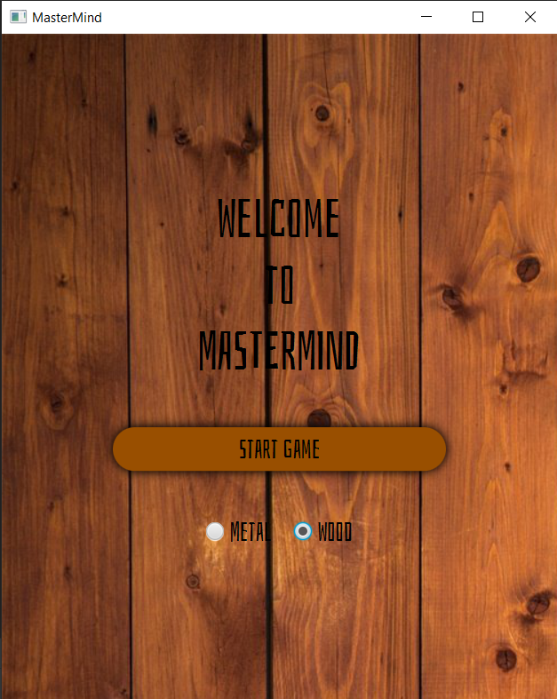
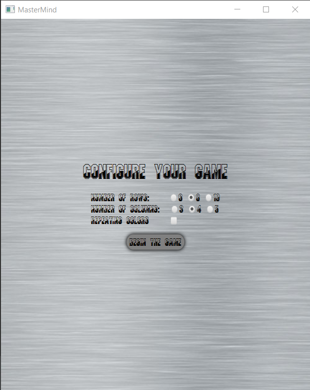
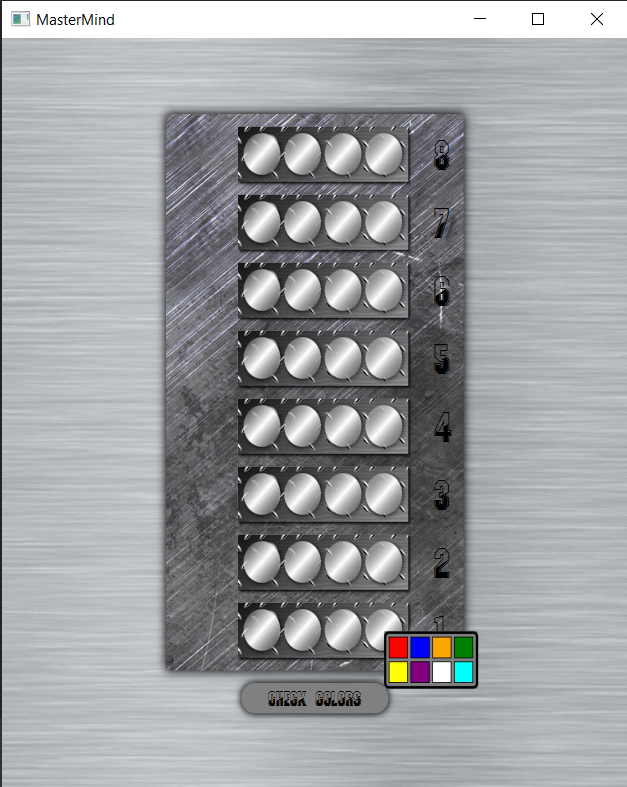
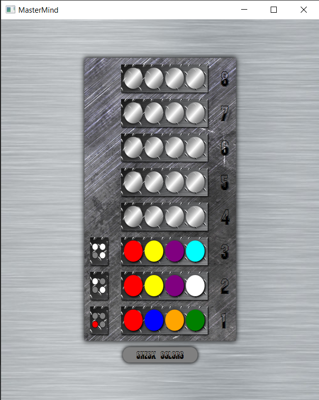
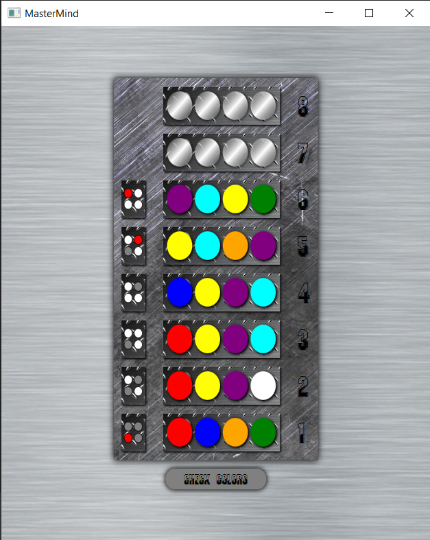

# MasterMind
MasterMind board game made in javafx.
Migrated to gradle.

## Table of Contents
* [General Info](#general-information)
* [Technologies Used](#technologies-used)
* [Features](#features)
* [Pictures](#pictures)
* [Setup](#setup)

<!-- * [License](#license) -->

## General Information

MasterMind is a logical board game. Normally there is one player who sets a row of colors.
The second player must find the right colors in correct order. In this case the role of the first player
is taken by computer who randomly generates a set of colors and grades the human player. 

## Technologies Used

- Java - version 11
- JavaFX - version 16

## Features

- choose between two style palletes (wood, metal)
- Adjust difficulty. Set number of rows and columns of the board. Also repeating colors can be set.

## Pictures

Start game

Choose different theme

Configure your game

Playing the game

  
  
  

## Setup
Java 11 and gradle 5 are required. Preferably use IntelliJ IDE. 
Download dependencies with:\
`gradle build`\
Then start the app with:\
`gradle run`
